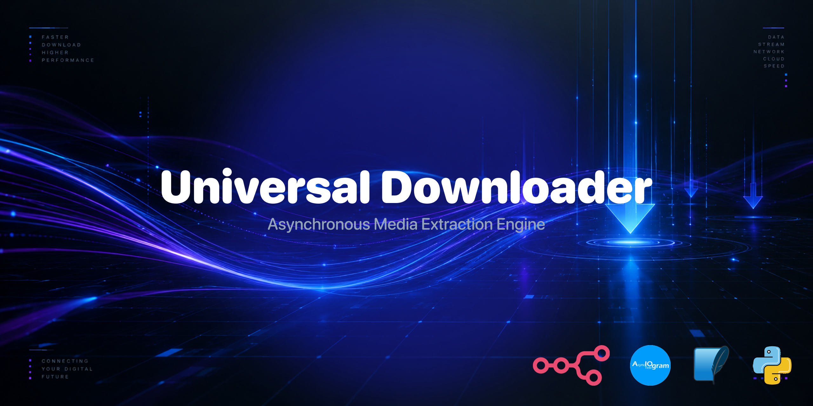

<p align="center">
  
</p>

<div align="center">

# 📥 Universal Asynchronous Media Downloader Telegram Bot

</div>

A high-performance, asynchronous Telegram bot designed to parse, extract, and stream media content (**Videos, Audio, and Photos**) from **any internet source** (YouTube, TikTok, VK, Pinterest, Reddit, etc.) directly into Telegram chats, backed by an ultra-fast SQLite caching layer.

<div align="center">

## 🎯 The Core Product Vision & Business Value

</div>

* **The Problem:** Content creators, SMM managers, and digital designers constantly need high-quality source files (videos, tracks, or high-res images/thumbnails) from various web platforms for research, repurposing, or editing. Relying on sketchy, ad-heavy web downloaders slows down production workflows and creates security vulnerabilities.
* **The Solution:** A unified, ad-free tool right inside Telegram. By dropping any valid URL, the user gets direct access to high-quality MP4/M4A streams or full-resolution photos. The bot automatically manages disk spaces and cloud storage via database optimizations.

<div align="center">

## 🛠️ Key Features & Technical Highlights

</div>

* **Universal Platform Architecture:** Driven by the raw power of `yt-dlp`, the bot supports thousands of global streaming and social platforms out-of-the-box. It automatically evaluates link protocols dynamically.
* **Smart Telegram File ID Caching:** Before downloading heavy media to the host server, the system queries the SQLite database. If a file has been downloaded before, it is delivered **instantly** via Telegram's internal `tg_file_id` (works for videos, audio, and photos), saving bandwidth, disk usage, and CPU cycles.
* **Asynchronous Execution Loop:** Built on top of `Aiogram 3.x` and `SQLAlchemy`, processing high-volume traffic happens concurrently without blocking user interaction thresholds.
* **Zero Server Noise:** Production-optimized code with removed verbose server logging routines for lightning-fast execution and maximum privacy.

<div align="center">

## 📂 Code Architecture

</div>

The codebase strictly follows professional asynchronous patterns, isolating data mutations, route orchestration, and the extraction engine into decoupled modules:

```text
Downloader-Bot/
├── .gitignore
├── LICENSE
├── README.md
├── requirements.txt
├── banner.png
├── main.py
│
└── app/
    ├── __init__.py
    ├── config.py
    ├── ui_text.py
    │
    ├── database/
    │   ├── __init__.py
    │   ├── db_manager.py
    │   └── models.py
    │
    ├── handlers/
    │   ├── __init__.py
    │   ├── callback.py
    │   ├── commands.py
    │   └── media.py
    │
    ├── keyboards/
    │   ├── __init__.py
    │   └── inline.py
    │
    └── services/
        ├── __init__.py
        └── downloader.py
```

<div align="center">

## 🔌 No-Code & Entrepreneurial Scaling (n8n Integration)

</div>

This bot serves as a perfect foundational micro-SaaS framework. It can be easily integrated into **n8n automation workflows**:
1. **Subscription & Paywall Hub:** Connect n8n webhooks to Stripe, PayPal, or crypto gateways. Once a payment is confirmed, n8n alters the user's tier inside `downloader.db`, unlocking premium speeds or expanding daily conversion tokens.
2. **Automated Backup & Archive Grid:** Use n8n to monitor download logs. When trending media files are generated, n8n can automatically fetch the file, apply custom watermarks via FFmpeg, and upload copies directly to private storage vaults (AWS S3 or Google Drive).

<div align="center">

## 🚀 How to Run Locally

</div>

1. Clone the repository:
   ```bash
   git clone https://github.com/Hades-db/Downloader-Bot
   ```
2. Navigate to the project directory:
   ```bash
   cd Downloader-Bot
   ```
3. Install dependencies:
   ```bash
   pip install -r requirements.txt
   ```
4. Create a `.env` file in the root folder and add your bot credentials:
   ```env
   TOKEN=YOUR_TELEGRAM_BOT_TOKEN
   ```
5. Launch the bot:
   ```bash
   python main.py
   ```
